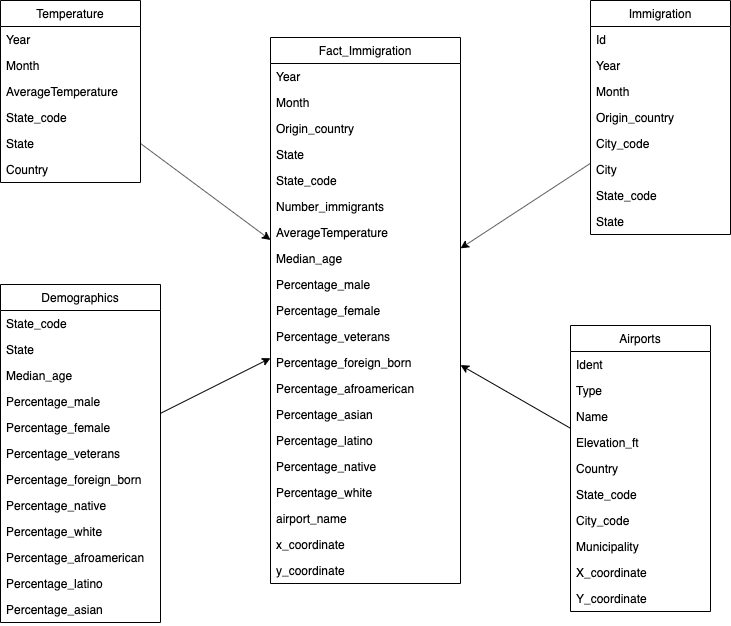

# Data Engineering Capstone Project
> José Luis Gil Aguilar

## Project Summary
The project consists in develop a Fact Table with the data sources provided by Udacity Provided Project. The technologies involved were Pandas, Spark, Fbprohet and Matplotlib.

## The project follows the follow steps:

Step 1: Scope the Project and Gather Data
Step 2: Explore and Assess the Data
Step 3: Define the Data Model
Step 4: Run ETL to Model the Data
Step 5: Complete Project Write Up

### Files in Project
Tha main files for running the project are:

* `Capstone_DEND.ipynb`: Notebook with the step by step of the process.

* `utils.json`: Information with data equivalences for city and states codes.

### Schema for Immigration Analytics

